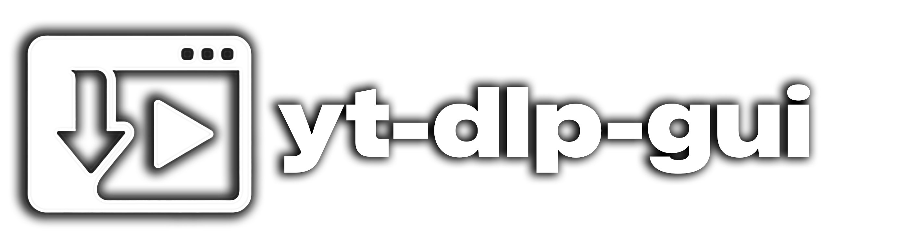
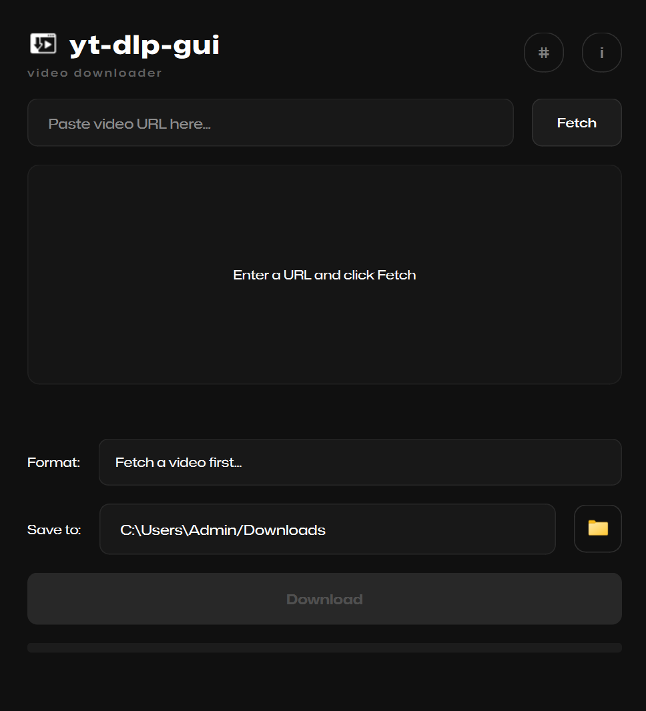

<p align="center">
  
  <br>
  <i>A modern video downloader interface</i>
</p>

<p align="center">
  <a href="https://github.com/enesehs/yt-dlp-gui/releases"></a>
  <a href="https://www.python.org/"></a>
  <a href="https://www.qt.io/"></a>
  <a href="https://doc.qt.io/qtforpython/"></a>
  <a href="https://github.com/yt-dlp/yt-dlp"></a>
  <a href="LICENSE"></a>
  <a href="https://github.com/enesehs/yt-dlp-gui/releases"></a>
</p>

A modern, cross-platform graphical user interface for [yt-dlp](https://github.com/yt-dlp/yt-dlp), built with Python and Qt6 (PySide6). Designed to make video downloading simple and accessible through a clean, dark-themed interface.

---

## Features

- **Simple Interface**: Paste a URL, select format, and download
- **Format Selection**: Choose from available video qualities or audio-only options
- **Real-time Progress**: Visual progress bar with download speed and status
- **Thumbnail Preview**: See video thumbnails before downloading
- **Custom Download Location**: Save files to any directory
- **Log Viewer**: Built-in terminal-style log viewer for debugging
- **Cancel Support**: Stop downloads at any time
- **Cross-platform**: Works on Windows, Linux, and macOS

---

## Screenshots



---

## Installation

### Windows

Download the latest `.exe` from the [Releases](https://github.com/enesehs/yt-dlp-gui/releases) page and run it directly. No installation required.

### Linux

#### Portable Executable

Download the `yt-dlp-gui` executable from [Releases](https://github.com/enesehs/yt-dlp-gui/releases), make it executable, and run:

```bash
chmod +x yt-dlp-gui
./yt-dlp-gui
```

#### Arch Linux (AUR)

```bash
yay -S yt-dlp-gui
```

or with paru:

```bash
paru -S yt-dlp-gui
```

#### From Source

```bash
git clone https://github.com/enesehs/yt-dlp-gui.git
cd yt-dlp-gui
python -m venv venv
source venv/bin/activate
pip install -r requirements.txt
python main.py
```

### macOS

```bash
git clone https://github.com/enesehs/yt-dlp-gui.git
cd yt-dlp-gui
python3 -m venv venv
source venv/bin/activate
pip install -r requirements.txt
python main.py
```

---

## Usage

1. Launch the application
2. Paste a video URL into the input field
3. Click "Fetch" to retrieve video information
4. Select your preferred format from the dropdown
5. (Optional) Change the download location using the folder button
6. Click "Download" to start downloading
7. Use the "#" button to view detailed logs if needed

---

## Building from Source

### Requirements

- Python 3.9 or higher
- pip (Python package manager)

### Dependencies

All dependencies are listed in `requirements.txt`:

- PySide6 (Qt6 for Python)
- yt-dlp (video download engine)
- requests (HTTP library)
- pyinstaller (for building executables)

### Build for Windows

```batch
pip install -r requirements.txt
pyinstaller --noconfirm --onefile --windowed --name "yt-dlp-gui" ^
    --icon "assets/img/logo.ico" ^
    --add-data "src/ui/style.qss;src/ui" ^
    --add-data "assets/fonts/Mona-Sans.ttf;assets/fonts" ^
    --add-data "assets/img/logo.ico;assets/img" ^
    --add-data "assets/img/folder.svg;assets/img" ^
    --hidden-import "PySide6" ^
    main.py
```

The executable will be in the `dist` folder.

### Build for Linux (AppImage)

```bash
chmod +x build_linux.sh
./build_linux.sh
```

This creates a portable `yt-dlp-gui-x86_64.AppImage` file.

---

## Project Structure

```
yt-dlp-gui/
├── main.py                 # Application entry point
├── requirements.txt        # Python dependencies
├── PKGBUILD               # Arch Linux package build file
├── build_linux.sh         # Linux AppImage build script
├── build_windows.bat      # Windows build script
├── src/
│   ├── logic/
│   │   └── downloader.py  # Download logic and yt-dlp wrapper
│   └── ui/
│       ├── main_window.py # Main application window
│       ├── log_viewer.py  # Log viewer dialog
│       └── style.qss      # Qt stylesheet (dark theme)
└── assets/
    ├── fonts/
    │   └── Mona-Sans.ttf  # Custom font
    └── img/
        ├── logo.ico       # Application icon
        └── folder.svg     # Folder icon for browse button
```

---

## Configuration

The application uses sensible defaults:

- **Default download location**: User's Downloads folder
- **Default format**: Best available quality (video + audio)

These can be changed through the interface during runtime.

---

## Supported Sites

yt-dlp-gui supports all websites that yt-dlp supports, including but not limited to:

- YouTube
- Vimeo
- Twitter/X
- Instagram
- TikTok
- Twitch
- SoundCloud
- And [many more](https://github.com/yt-dlp/yt-dlp/blob/master/supportedsites.md)

---

## Troubleshooting

### Video not downloading

- Check if the URL is valid and accessible
- Some sites may require authentication or have restrictions
- View the logs (click "#" button) for detailed error messages

### Application won't start

- Ensure you have the required dependencies installed
- On Linux, you may need to install Qt6 libraries:
  ```bash
  # Debian/Ubuntu
  sudo apt install libxcb-xinerama0
  
  # Fedora
  sudo dnf install qt6-qtbase
  ```

### Format not available

- Some videos have limited format options
- Try selecting "Best Quality" for automatic format selection

---

## Contributing

Contributions are welcome! Please feel free to submit issues and pull requests.

1. Fork the repository
2. Create your feature branch (`git checkout -b feature/amazing-feature`)
3. Commit your changes (`git commit -m 'Add amazing feature'`)
4. Push to the branch (`git push origin feature/amazing-feature`)
5. Open a Pull Request

---

## License

This project is licensed under the MIT License. See the [LICENSE](LICENSE) file for details.

---

## Acknowledgments

- [yt-dlp](https://github.com/yt-dlp/yt-dlp) - The powerful video download engine
- [PySide6](https://doc.qt.io/qtforpython/) - Qt for Python
- [Mona Sans](https://github.com/github/mona-sans) - GitHub's variable font

---

## Developer

**enesehs**

- Website: [enesehs.dev](https://enesehs.dev)
- GitHub: [@enesehs](https://github.com/enesehs)
